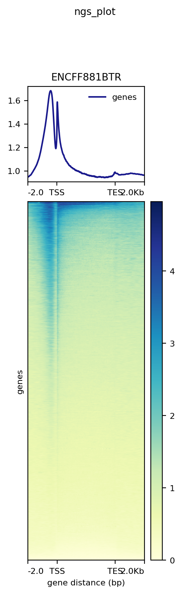

# hse23_hw2
https://colab.research.google.com/drive/1B_VT25idB199oDCpcM5npTGaSCH3IQS7?usp=sharing

### FastQC и MultiQC анализ.
Результаты приведены в виде файлов pdf в папке data.
#### ENCFF411MHC

#### ENCFF479VFS

#### ENCFF364HZK

#### MultiQC

Не было необходимости подрезать чтения.

### Статистика.
Образец | Ридов | Выровн. уникально | Выровн. НЕуникально | НЕ выровн.
-|-|-|-|-
ENCFF411MHC | 21830825 | 882684 | 1691747 |19256394
ENCFF479VFS | 34425242 | 1410567 | 2708870 |30305805
ENCFF364HZK | 69344412 | 2820775 | 4540146 |61983491

Получен низкий процент выравнивания, так как риды со всего генома мы картирует лишь на одну хромосому.

### Диаграммы Венна.
Диаграммы приведены в виде файлов pdf в папке data.
#### ENCFF411MHC

#### ENCFF479VFS

Количество пересечений отличается, поскольку в одном случае берутся полученные пики, пересекающиеся с пиками ENCODE; а в другом случае отбираются пики ENCODE, совпавшие с пиками, которые получили мы.

### ngs.plot

ENCFF411MHC | ENCFF479VFS
-|-
 | 

Li e. al. (2007) Cell

Данные ChIP-seq эксперимента из ENCODE согласуются с данными из статьи.
